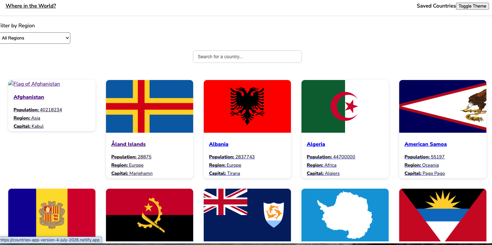
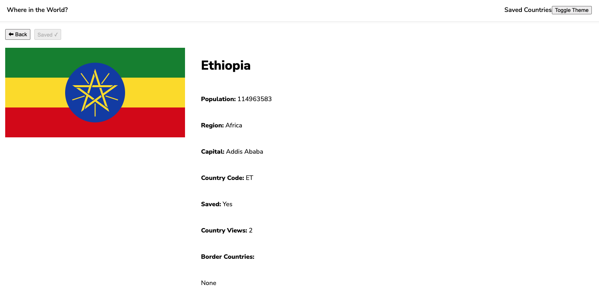
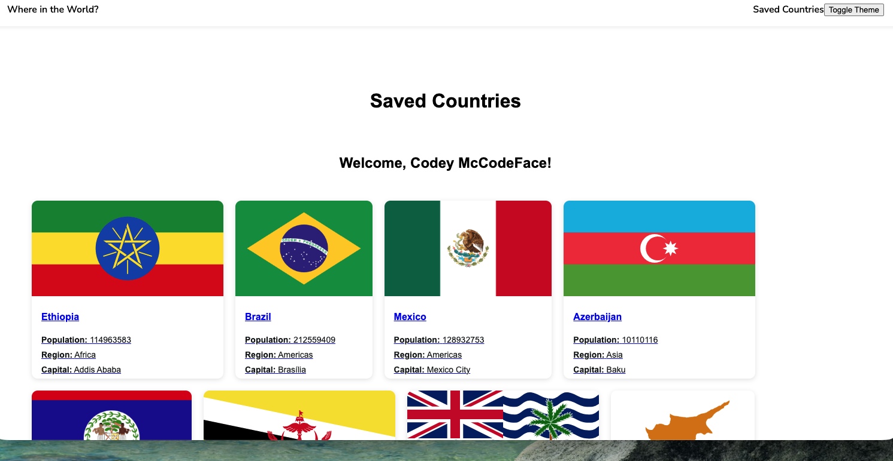

# 🌎 Countries App

## 📌 Project Description & Purpose

This project is Arianne's Countries App, a full-stack web application where users can explore countries around the world, save favorite countries, track country views, and submit user information.

The purpose of this project was to practice building a full-stack application by connecting a React frontend, an Express API server, and a PostgreSQL database.

## 🚀 Live Site

Here's the link to view the live app:

https://countries-app-version-four.netlify.app/

## 🖼️ Screenshots

### Home Page



### Country Detail Page



### Saved Countries Page



## ✨ Features

This is what you can do on the app:

- View countries from around the world
- Filter countries by region
- View country details
- Save favorite countries
- Prevent duplicate saved countries
- Track how many times a country has been viewed
- Submit user information through a form
- Store user and country data in a PostgreSQL database

## 🛠️ Tech Stack

**Frontend**

- **Languages:** JavaScript, HTML, CSS
- **Library:** React
- **Build Tool:** Vite
- **Deployment:** Netlify

**Server/API**

- **Languages:** JavaScript
- **Framework:** Express.js
- **Runtime:** Node.js
- **Deployment:** Render

**Database**

- **Language:** SQL
- **Database:** PostgreSQL
- **Deployment:** Neon

## 🔹 API Documentation

These are the API endpoints I built:

1. `/get-all-saved-countries`
2. `/save-one-country`
3. `/update-one-country-count`
4. `/add-one-user`
5. `/get-newest-user`

Here's the link to the full API documentation:

https://github.com/ariannecope/countries-app
https://github.com/ac-backend/countries-app-instructions/blob/main/version-3/api-documentation.md

## 🗄️ Database Schema

Here are the SQL tables used for this project:

```sql
CREATE TABLE saved_countries (
  saved_country_id SERIAL PRIMARY KEY,
  country_name TEXT UNIQUE NOT NULL
);
```

```sql
CREATE TABLE country_counts (
  country_count_id SERIAL PRIMARY KEY,
  country_name TEXT UNIQUE NOT NULL,
  count INTEGER DEFAULT 0
);
```

```sql
CREATE TABLE users (
  user_id SERIAL PRIMARY KEY,
  name TEXT NOT NULL,
  country_name TEXT,
  email TEXT,
  bio TEXT
);
```

Example SQL used to save countries:

```sql
INSERT INTO saved_countries (country_name)
VALUES ($1)
ON CONFLICT (country_name) DO NOTHING;
```

Example SQL used to update country views:

```sql
INSERT INTO country_counts (country_name, count)
VALUES ($1, 1)
ON CONFLICT (country_name)
DO UPDATE SET count = country_counts.count + 1
RETURNING count;
```

## 💭 Reflections

**What I learned:**

I learned how to create a database and deploy it using Neon, how to build an Express API locally and deploy it using Render, and how to connect a React frontend to a backend API.

**What I'm proud of:**

This is my first CRUD application. The entire loop of the frontend, backend, and database working together was a huge milestone for me. It was incredibly satisfying to see the databases I built in Neon update through user interaction on my website.

**What challenged me:**

Learning how to debug during deployment was one of the biggest challenges. I also had to adapt when the source of the countries data changed halfway through the project.

**Future ideas for how I'd continue building this project:**

1. Add user accounts with authentication so each user can have their own saved countries.
2. Add more detailed country information, like languages, topography, or population history.
3. Add a community feature where users can share favorite places they've visited and their travel stories.

## 🙌 Credits & Shoutouts

Built as part of my full-stack development coursework.

Thanks to my instructors and classmates for helping me learn and debug throughout the project.

